# Project Narrative Report: SQL Query Runtime Prediction

This document tells the full story of the project in order -- what the aim was, what the results showed, how the aim evolved in response to the evidence, and what changed at each stage. All numbers come directly from the reports in this codebase.

> **Figures** are saved in `reports/narrative_figures/` and produced by `run_report_graphs.py` (figures 1-12) and `run_phase6_figures.py` (figures 13-14).

---

## The Data: Small but Quality-Focused

The dataset is small by machine learning standards. That is by design.

Each query was **timed by actually running it** against its real SQLite database -- typically 3 timing runs per query with a 30-second timeout. This is slower and more expensive than scraping a query log, but it means every label is a measured physical observation, not an inferred estimate.

| Stage            | Raw rows collected | Labelled rows used | Fast | Slow |
|------------------|--------------------|---------------------|------|------|
| Initial pipeline | 425                | 320                 | 213  | 107  |
| Data expansion   | 498                | 374                 | 249  | 125  |

**Figure 12** -- Query counts per database (shows data volume imbalance):
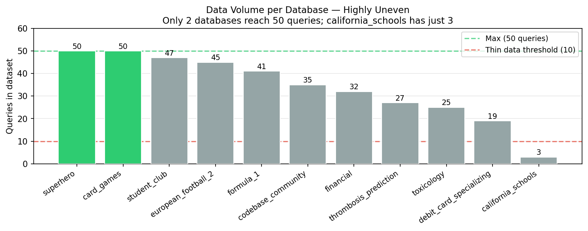

The dataset spans **11 databases** from the BIRD Mini-Dev benchmark:

| Database                  | Queries | Fast | Slow | % Slow |
|---------------------------|---------|------|------|--------|
| superhero                 | 50      | 50   | 0    | 0%     |
| card\_games               | 50      | 7    | 43   | 86%    |
| student\_club             | 47      | 47   | 0    | 0%     |
| european\_football\_2     | 45      | 8    | 37   | 82%    |
| formula\_1                | 41      | 38   | 3    | 7%     |
| codebase\_community       | 35      | 3    | 32   | 91%    |
| financial                 | 32      | 28   | 4    | 12%    |
| thrombosis\_prediction    | 27      | 27   | 0    | 0%     |
| toxicology                | 25      | 24   | 1    | 4%     |
| debit\_card\_specializing | 19      | 14   | 5    | 26%    |
| california\_schools       | 3       | 3    | 0    | 0%     |

---

## Phase 1 -- Original Aim: Can the Model Generalise to Unseen Databases?

**Justification:** This is the question that defines whether the tool is actually useful. If a model can only predict runtime on databases it has already seen during training, it cannot be deployed in practice -- every new production database would require a full retraining cycle. The real-world value is in a model that generalises: install it on a new schema and it works immediately. Phase 1 tests exactly that.

The pipeline held out `financial` and `formula_1` as unseen test databases and trained on the remaining 9.

**Figure 1** -- Seen vs Unseen F1 and ROC-AUC:
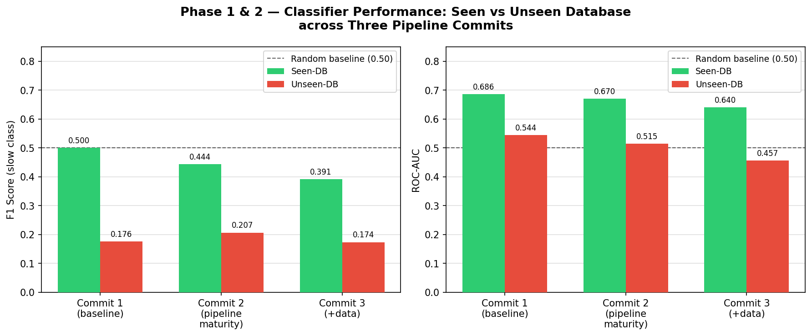

**Figure 11** -- All classifier models compared:
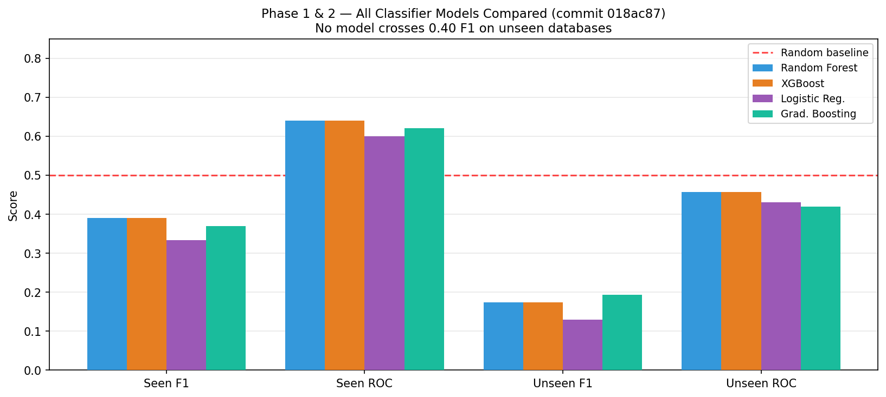

### Main classifier results (financial + formula_1 holdout):

| Best model | Unseen F1 | Unseen ROC-AUC | Unseen Accuracy |
|------------|-----------|----------------|-----------------|
| XGBoost    | 0.1765    | 0.5442         | 0.4909          |
| XGBoost    | 0.2069    | 0.5148         | 0.5490          |
| XGBoost    | 0.1739    | 0.4567         | 0.4795          |

**Figure 6** -- Confusion matrix on the unseen holdout:
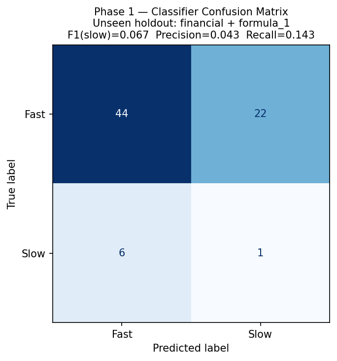

Per-database breakdown on the unseen holdout:

| Database   | Support | Accuracy | F1    | Precision | Recall |
|------------|---------|----------|-------|-----------|--------|
| financial  | 32      | 0.4375   | 0.182 | 0.111     | 0.500  |
| formula\_1 | 41      | 0.5854   | 0.190 | 0.111     | 0.667  |

**What this said:** Unseen-DB F1 peaked at 0.21 and ROC-AUC fell to 0.46 -- below the level of a coin flip. When the model flagged a query as slow on an unseen database, it was wrong approximately **9 times out of 10** (precision = 0.111). The model was not transferring.

---

## Phase 2 -- Aim Shifts to Seen-DB Performance (and Why the Results Are Misleading)

**Justification:** After Phase 1 showed near-zero unseen transfer, the natural question was whether the model had learned anything at all. The simplest check is seen-DB performance: does it work on databases it has already trained on? If it fails here too, the problem is the features. If it succeeds here but fails on unseen databases, the problem is generalisation. Phase 2 makes that diagnosis. The unexpected finding -- that performance got *worse* as data improved -- is itself a key discovery that re-shaped the rest of the project.

Because unseen transfer was so poor, focus moved to whether the model at least works on databases it has already seen. The evaluation used a within-database unseen-query split: train on some queries from a schema, test on other queries from the same schema.

**Figure 2** -- Seen-DB F1 declining as pipeline improved (expected trend is upward):
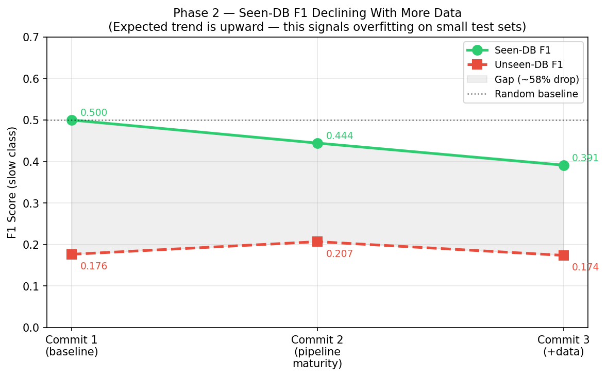

### Seen-DB classifier results:

| Best model    | Seen F1 | Seen ROC-AUC | Seen Accuracy |
|---------------|---------|--------------|---------------|
| Random Forest | 0.5000  | 0.6863       | 0.6765        |
| XGBoost       | 0.4444  | 0.6701       | 0.6378        |
| Random Forest | 0.3913  | 0.6400       | 0.6410        |

On the surface, seen-DB performance looks much better. But two things undermine confidence in these numbers.

### Why these results are likely an outlier effect, not genuine learning

**1. The test sets are tiny.**

The seen-DB slow-class test count is only 20-30 queries across all databases at most. On test sets this small, a single correct or incorrect prediction swings F1 by 0.05-0.15. An F1 of 0.50 could reflect correctly identifying 3 of 5 slow queries in one lucky split -- not a model that has genuinely learned to detect slow queries.

**2. Performance fell as more data was added -- the wrong direction.**

| Pipeline stage | Change | Seen F1 movement |
|----------------|--------|------------------|
| Baseline       | Initial pipeline | 0.500 |
| Pipeline improved | Better preprocessing | 0.444 (-0.056) |
| Data expanded  | +54 labelled rows added | 0.391 (-0.053) |

Every time the pipeline improved or more data was added, seen-DB F1 went down. A model that genuinely learned the signal should improve or stay stable with more data. Declining performance when you add real data is the signature of a model that was **overfitting to specific outliers in a small test split**, not learning a general pattern.

**3. The tree ablation seen-DB ROC saturates at ceiling.**

On the matched tree-eligible subset, seen-DB ROC-AUC reached 0.94-1.00:

| Pipeline stage | Global seen ROC | Tree+Global seen ROC |
|----------------|-----------------|----------------------|
| Baseline       | 0.9444          | 0.9524               |
| Pipeline improved | 0.9939       | 1.0000               |
| Data expanded  | 1.0000          | 1.0000               |

ROC-AUC of 1.0 on a training-adjacent evaluation with ~10-16 slow queries in the test fold is a near-certain sign of overfitting. The model is not learning runtime patterns -- it is memorising schema-specific cues that perfectly separate the tiny slow-class test sample.

**The overall seen-vs-unseen gap confirms this:** F1 drops by approximately **58%** when moving from seen to unseen databases (0.445 to 0.186). A model that genuinely understood runtime complexity would not lose more than half its predictive ability just by changing schema.

---

## Phase 3 -- Classifiers Were the Issue: Switching to Regression

**Justification:** The binary fast/slow classifier had a structural weakness: it could not say *how much* slower a query is. Its performance metrics (F1, ROC-AUC) are highly sensitive to the specific threshold and test-set composition -- on a holdout with only 3-7 slow queries, one prediction changes F1 by 0.10. Switching to regression removes the threshold problem entirely, uses the full information in the runtime measurement, and makes failures more visible: instead of "F1 = 0.18", you see "MAE = 5,553 seconds" -- which is unambiguously catastrophic. Regression also opens the door to future work that needs a continuous risk score, not a binary label.

The regression experiment used the same holdout (financial + formula_1 as unseen databases) and trained on the same 301 rows from 9 databases. The target was `log(runtime_s)` due to the heavily right-skewed runtime distribution.

**Figure 7** -- Predicted vs actual runtime (regression, financial + formula_1 holdout):
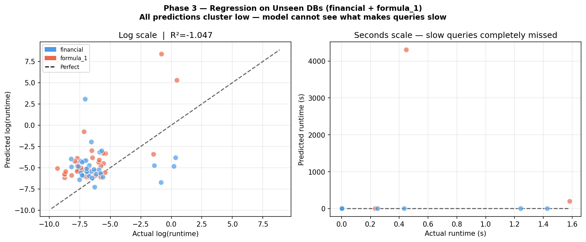

### Regression results -- financial + formula_1 as unseen holdout:

| Model             | MAE (log) | RMSE (log) | R2 (log)  | MAE (s)     |
|-------------------|-----------|------------|-----------|-------------|
| Linear Regression | 2.6036    | 3.6613     | -2.0381   | 12,333.98s  |
| Ridge (a=1)       | 2.5696    | 3.5528     | -1.8607   | 5,553.84s   |
| Ridge (a=10)      | **2.3846**| **3.0053** | **-1.0469** | 61.98s    |
| Lasso             | 2.4342    | 3.1485     | -1.2467   | 231.10s     |

For comparison, **seen-DB regression baseline** (within-DB split, Ridge a=1):

| Metric    | Seen-DB | Unseen-DB (Ridge a=1) |
|-----------|---------|-----------------------|
| MAE (log) | 2.9913  | 2.5696                |
| R2 (log)  | -0.1471 | -1.8607               |

Per-database on the unseen holdout:

| Database   | n  | Runtime range       | MAE (log) | R2 (log)  | MAE (s)     |
|------------|----|---------------------|-----------|-----------|-------------|
| financial  | 32 | 0.0003s - 1.4276s   | 2.5737    | -1.5730   | 19.33s      |
| formula\_1 | 41 | 0.0001s - 1.5830s   | 2.5665    | -2.2532   | 9,873.45s   |

**All R2 values are negative.** The regression is worse than guessing the training mean for every query. The errors in seconds are enormous -- driven by the handful of slow queries in the holdout being predicted as fast. When you exponentiate a large log-scale error, the seconds-scale RMSE becomes astronomical.

**What this confirmed about classifiers:** The classifier's F1 of 0.18-0.21 on these databases was not a sign of partial learning. It was the model accidentally catching 1-2 of the 3-7 slow queries per database by chance. Regression makes this visible: the model has no continuous understanding of runtime at all on unseen schemas.

---

## Phase 4 -- Incorrect Assumption: The Distribution of Queries Was Worse Than Expected

**Justification:** By this point, both the classifier and the regression had failed on unseen databases. Before changing the model architecture again, the data itself needed interrogating. If the labels are structurally broken -- encoding schema identity rather than query complexity -- no model can succeed regardless of architecture. Phase 4 is a forensic analysis of the data that explains why the labels are unreliable, justifying why the problem is fundamentally harder than it first appeared.

Two structural problems emerged that had been masked by the classifier evaluation.

**Figure 4** -- Fast / Mid / Slow label split showing the dropped middle bracket:
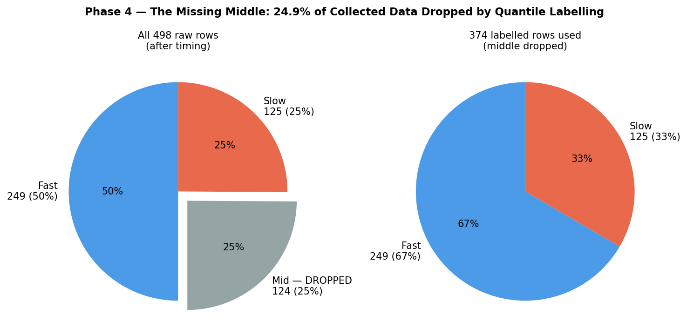

**Figure 5** -- Runtime distribution (raw and log scale):
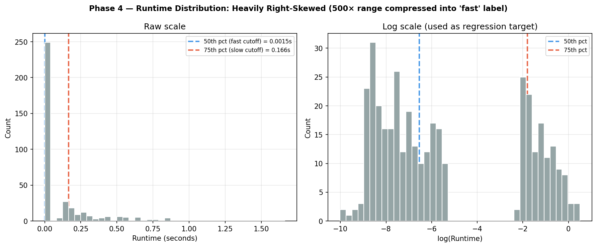

### Problem A: A quarter of the data was silently dropped

The labelling method used quantile-based bucketing: top 25% of runtimes labelled **slow**, bottom 50% labelled **fast**, middle 25% **dropped** as ambiguous.

| Label         | Count | % of raw collected |
|---------------|-------|--------------------|
| fast          | 249   | 50.0%              |
| mid (dropped) | 124   | 24.9%              |
| slow          | 125   | 25.1%              |

**124 queries -- nearly a quarter of all collected data -- were thrown away.** The intent was to keep labels clean by avoiding the ambiguous middle. The consequence is that the model never saw borderline queries, the gap between classes was artificially widened, and the runtime continuum was hidden.

The runtime distribution shows just how compressed this is:

| Percentile | Runtime     |
|------------|-------------|
| min        | 0.000044s   |
| 25th       | 0.000333s   |
| 50th       | 0.001451s   |
| 75th       | 0.165947s   |
| max        | 1.662923s   |

The 25th-75th percentile spans 0.000333s to 0.166s -- a **500x range** all compressed into the single "fast" label.

**Figure 3** -- Label distribution per database (skew across schemas):
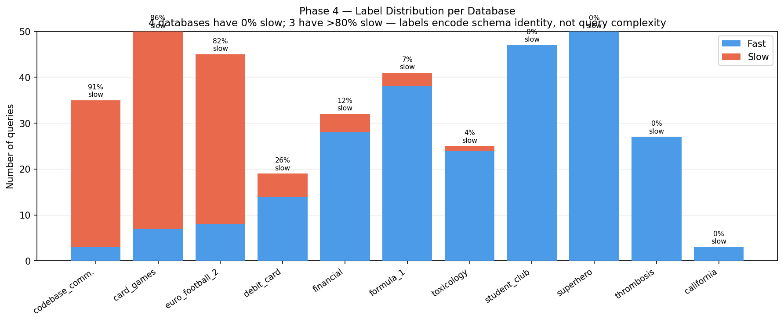

### Problem B: Labels are schema-specific, not complexity-specific

The per-database slow percentages vary wildly:

| Database               | % Slow | Problem                           |
|------------------------|--------|-----------------------------------|
| codebase\_community    | 91%    | Almost everything labelled slow   |
| card\_games            | 86%    | Almost everything labelled slow   |
| european\_football\_2  | 82%    | Almost everything labelled slow   |
| student\_club          | 0%     | No slow queries at all            |
| superhero              | 0%     | No slow queries at all            |
| thrombosis\_prediction | 0%     | No slow queries at all            |
| california\_schools    | 0%     | No slow queries at all            |
| formula\_1             | 7%     | Effectively all fast              |
| toxicology             | 4%     | Effectively all fast              |

**4 out of 11 databases have zero slow queries.** Those databases contribute nothing to the model's understanding of what a slow query looks like. **3 databases are over 80% slow**, meaning a model trained on schemas with balanced class distribution will encounter an almost completely inverted prior when it reaches these databases.

The quantile labels are computed globally across all databases -- so a "fast" query in card\_games might be slower in absolute seconds than a "slow" query in superhero. The classifier was partly learning to identify which database a query came from, not how complex the query is. This is why the feature coefficients show schema-specific artefacts (ORDER BY predicting faster, subqueries predicting faster) -- the model absorbed schema-identity signal disguised as complexity signal.

---

## Phase 5 -- Focused Experiment: Only the Two Databases with 50 Queries

**Justification:** Given the label distribution problems in Phase 4, most databases are either entirely fast or entirely slow -- they cannot provide a balanced test of whether the model distinguishes between the two classes. The only databases with enough queries to form a meaningful train/test split and a genuine mix of runtimes are superhero (50 queries, all fast) and card\_games (50 queries, 86% slow). Phase 5 isolates these two to ask: even in the best case, with the most data, can a regression model predict runtime within a specific schema?

The experiment ran regression with superhero + card\_games as holdout and the remaining 274 rows as training. Three feature variants were compared:

- **Global**: 25 SQL structural features
- **Matched Global**: same features, same rows (all 374 queries pass EXPLAIN here, so identical to Global)
- **Tree+Global**: adds 9 EXPLAIN QUERY PLAN features (plan step count, scan nodes, search nodes, temp B-tree sorts, correlated subqueries, co-routines, union nodes, subquery nodes, materialise nodes)

**Figure 8** -- Predicted vs actual runtime scatter for superhero and card\_games:
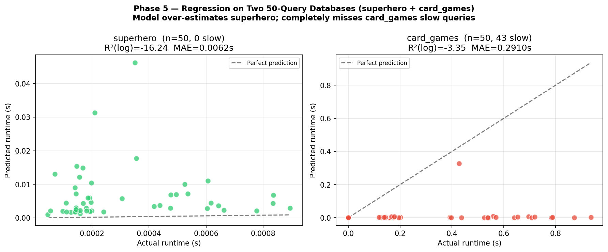

**Figure 10** -- R2 comparison across all regression experiments:
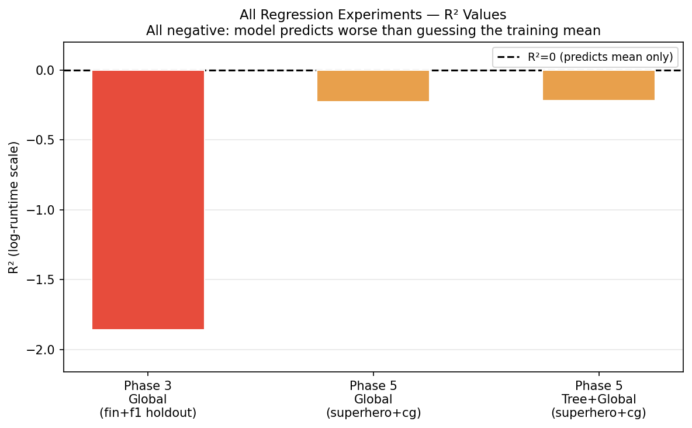

### Regression results -- superhero + card\_games as holdout:

| Variant        | Best model  | MAE (log) | RMSE (log) | R2 (log)  | MAE (s)  | R2 (s)   |
|----------------|-------------|-----------|------------|-----------|----------|----------|
| Global         | Ridge a=10  | 3.5490    | 3.8787     | -0.2288   | 0.1486s  | -0.3495  |
| Matched Global | Ridge a=10  | 3.5490    | 3.8787     | -0.2288   | 0.1486s  | -0.3495  |
| Tree+Global    | Lasso       | 3.5265    | 3.8642     | -0.2196   | 0.1500s  | -0.3603  |

All models, global feature set:

| Model             | MAE (log)  | R2 (log)   | MAE (s)    | R2 (s)   |
|-------------------|------------|------------|------------|----------|
| Linear Regression | 3.5719     | -0.2690    | 0.1563s    | -0.4808  |
| Ridge (a=1)       | 3.5612     | -0.2589    | 0.1521s    | -0.3852  |
| Ridge (a=10)      | **3.5490** | **-0.2288**| **0.1486s**| -0.3495  |
| Lasso             | 3.5552     | -0.2366    | 0.1479s    | -0.3492  |

**All R2 values remain negative.** Tree+Global offers negligible improvement (MAE(log) 3.527 vs 3.549 -- a difference of 0.022 log-units).

### Per-database breakdown (Ridge a=1, global features):

**superhero** -- 50 queries, all under 1 millisecond (0.000044s-0.000932s):

| Metric         | Value     |
|----------------|-----------|
| MAE (log)      | 2.8316    |
| R2 (log)       | -15.90    |
| MAE (seconds)  | 0.0058s   |
| R2 (seconds)   | -1,501    |

The model overestimates superhero runtimes by 10-30x. Trained on databases where runtimes span milliseconds to seconds, it predicts 12-34ms for queries that finish in under 0.1ms.

**card\_games** -- 50 queries, runtimes 0.000381s-0.936480s:

| Metric         | Value    |
|----------------|----------|
| MAE (log)      | 4.2909   |
| R2 (log)       | -3.55    |
| MAE (seconds)  | 0.2983s  |
| R2 (seconds)   | -1.28    |

The model completely misses the slow queries. Five worst predictions:

| Actual (s) | Predicted (s) | Error (s) | Difficulty  |
|------------|---------------|-----------|-------------|
| 0.9365     | 0.0019        | 0.9346    | challenging |
| 0.8721     | 0.0015        | 0.8706    | simple      |
| 0.7878     | 0.0031        | 0.7847    | moderate    |
| 0.7846     | 0.0008        | 0.7838    | moderate    |
| 0.7199     | 0.0038        | 0.7161    | challenging |

Queries taking 720ms-937ms are predicted to take 1-4ms. One of the five worst is labelled **simple** difficulty -- SQL structural features do not explain why it is slow. The slowness is driven by something internal to the card\_games schema (table sizes, data volume, index coverage) that the feature set cannot see.

---

## Phase 6 -- Adding Schema Statistics: Training Within Each Database

**Justification:** Phases 1-5 consistently pointed to the same root cause: the model had no knowledge of the schema it was operating on. A "simple" card\_games query takes 0.87 seconds because card\_games has 800,000 rows in its largest table and only 29% of its tables are indexed -- facts completely invisible to the SQL structural features. Phase 6 tests the natural fix: add database-level schema statistics (table row counts, index coverage) directly to the feature set. Simultaneously, it changes the evaluation strategy from cross-database to within-database: rather than asking whether the model generalises to new schemas, it asks whether the model can explain runtime *within a schema it knows*. This is a fairer test of whether the feature set is fundamentally useful.

**Script:** `run_schema_stats_model.py`
**Results CSV:** `reports/within_db_schema_metrics.csv`

### New features added (6 schema statistics per database)

| Feature                  | Description                                                  |
|--------------------------|--------------------------------------------------------------|
| `schema_n_tables`        | Number of tables in the database                             |
| `schema_total_rows`      | Total row count across all tables                            |
| `schema_max_table_rows`  | Largest row count in any single table                        |
| `schema_total_indexes`   | Total number of indexes defined in the database              |
| `schema_index_coverage`  | Fraction of tables that have at least one index (0-1)        |
| `schema_log_total_rows`  | log(schema_total_rows + 1) -- log-scaled database size       |

Extracted directly from each SQLite database via `PRAGMA index_list()` and `SELECT COUNT(*)`.

### Schema statistics per database

| Database                  | Total rows  | Max table rows | Indexes | Index coverage | Mean runtime |
|---------------------------|-------------|----------------|---------|----------------|--------------|
| superhero                 | 10,614      | 5,825          | 0       | 0.00           | 0.0003s      |
| card\_games               | 803,451     | 427,907        | 2       | 0.29           | 0.2999s      |
| financial                 | 1,079,680   | 1,056,320      | 0       | 0.00           | slow         |
| formula\_1                | 493,267     | 400,524        | 7       | 0.50           | mixed        |
| student\_club             | 42,511      | 41,877         | 7       | 0.88           | 0.0002s      |
| european\_football\_2     | 222,803     | 183,978        | 6       | 0.62           | 0.1936s      |
| codebase\_community       | 740,646     | 303,155        | 3       | 0.38           | 0.4882s      |
| debit\_card\_specializing | 423,051     | 383,282        | 4       | 0.67           | 0.0739s      |
| toxicology                | 36,922      | 18,312         | 4       | 1.00           | 0.0098s      |
| thrombosis\_prediction    | 15,252      | 13,908         | 1       | 0.33           | 0.0011s      |
| california\_schools       | 29,941      | 17,686         | 3       | 1.00           | fast         |

The pattern is immediately visible: large tables with poor index coverage (card\_games, financial, codebase\_community) have high mean runtimes. Small tables or well-indexed tables (superhero, student\_club, toxicology) are consistently fast regardless of query complexity.

### Evaluation: within-database 80/20 split

Each database was trained and tested independently: 80% of its queries used for training, 20% held out for testing. This removes the cross-schema transfer problem entirely and tests whether, given enough examples from one schema, the model can predict runtime within that schema.

### Results: best model per database

**Figure 13** -- Within-database R2(log), best model per database:
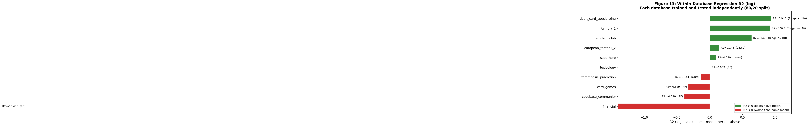

| Database                  | n  | slow% | total_rows  | idx_cov | Best model  | R2 (log) | MAE (log) | MAE (s)  |
|---------------------------|----|-------|-------------|---------|-------------|----------|-----------|----------|
| debit\_card\_specializing | 19 | 26%   | 423,051     | 0.67    | Ridge(a=10) | **0.945**| 0.4457    | 0.031s   |
| formula\_1                | 41 | 7%    | 493,267     | 0.50    | Ridge(a=10) | **0.929**| 0.6961    | 0.152s   |
| student\_club             | 47 | 0%    | 42,511      | 0.88    | Ridge(a=10) | **0.640**| 0.1715    | 0.000049s|
| european\_football\_2     | 45 | 82%   | 222,803     | 0.62    | Lasso       | **0.148**| 1.1328    | 0.120s   |
| superhero                 | 50 | 0%    | 10,614      | 0.00    | Lasso       | 0.099    | 0.5004    | 0.000106s|
| toxicology                | 25 | 4%    | 36,922      | 1.00    | RF          | 0.009    | 0.7230    | 0.001s   |
| thrombosis\_prediction    | 27 | 0%    | 15,252      | 0.33    | GBM         | -0.141   | 0.6436    | 0.001s   |
| card\_games               | 50 | 86%   | 803,451     | 0.29    | RF          | -0.329   | 1.3097    | 0.195s   |
| codebase\_community       | 35 | 91%   | 740,646     | 0.38    | RF          | -0.390   | 0.3625    | 0.230s   |
| financial                 | 32 | 12%   | 1,079,680   | 0.00    | RF          | **-10.44**| 1.7059   | 0.007s   |

**Figure 14** -- Schema complexity vs model R2 (does index coverage or database size predict model failure?):
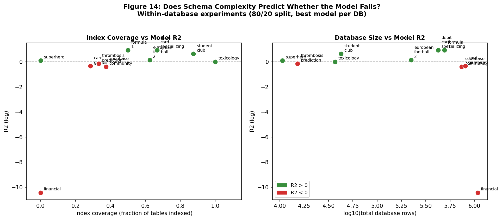

### What the results show

**Three databases achieve R2 > 0.60 within-database:**

- `debit_card_specializing` (R2 = 0.945): 19 queries, 67% index coverage, 26% slow. Ridge regression can explain 94% of runtime variance. The queries vary enough in structure and the schema is well-indexed enough that SQL features predict which ones are faster or slower.
- `formula_1` (R2 = 0.929): 41 queries, 50% index coverage, only 7% slow. Most queries are fast but the model can distinguish the few slow ones reliably.
- `student_club` (R2 = 0.640): 47 queries, all fast (0% slow), but runtime spans 0.000128s-0.000568s. Even within the fast range, the model captures relative variation.

**Three databases completely fail (R2 < -0.3):**

- `financial` (R2 = -10.44): 32 queries, **zero indexes**, 1,079,680 total rows. With no indexes, every query involves full table scans. Runtime is dominated by I/O and caching effects that the SQL text cannot predict. The model is nearly 10x worse than simply predicting the mean for every query.
- `codebase_community` (R2 = -0.39): 35 queries, 91% slow, 741K rows. When almost every query is slow, there is no variation in the outcome to model. The model has nothing to learn from the 3 fast queries in the training set.
- `card_games` (R2 = -0.33): 50 queries, 86% slow, 803K rows with poor indexing. Same problem as codebase\_community -- the structural features cannot distinguish which specific queries hit the unindexed large tables badly.

### The index coverage signal

Figure 14 (left panel) shows a clear pattern: **databases with high index coverage tend to have positive or near-zero R2; databases with zero or low index coverage consistently fail.** This is the causal story: when indexes are present, query runtime is governed by whether the query uses them (which SQL structural features can partially capture). When there are no indexes, runtime is governed by table scan timing, which is unpredictable from the query text alone.

Figure 14 (right panel) shows no clear relationship between total database size and R2 -- `debit_card_specializing` has 423K rows and R2 = 0.945, while `financial` has 1M rows and R2 = -10.44. Size alone is not the predictor; **index coverage mediates the effect of size**.

### All 5 models per database (full breakdown)

**card\_games** (n=50, 86% slow, 803K rows, idx\_cov=0.29):

| Model       | MAE (log) | R2 (log) | MAE (s)  | R2 (s)  |
|-------------|-----------|----------|----------|---------|
| Ridge(a=1)  | 1.7702    | -1.2863  | 0.5428   | -19.20  |
| Ridge(a=10) | 1.6127    | -0.8922  | 0.3235   | -3.16   |
| Lasso       | 1.7288    | -0.9469  | 0.4509   | -14.49  |
| RF          | **1.3097**| **-0.3285** | **0.1951** | -0.49 |
| GBM         | 1.6976    | -1.5856  | 0.2421   | -1.42   |

**formula\_1** (n=41, 7% slow, 493K rows, idx\_cov=0.50):

| Model       | MAE (log) | R2 (log) | MAE (s)  | R2 (s)  |
|-------------|-----------|----------|----------|---------|
| Ridge(a=1)  | 0.9714    | 0.8111   | 1.883    | -65.28  |
| Ridge(a=10) | **0.6961**| **0.9287** | 0.152  | **0.493** |
| Lasso       | 1.3947    | 0.5059   | 23.763   | -16,932 |
| RF          | 1.3047    | 0.3409   | 0.225    | -0.197  |
| GBM         | 1.5216    | -0.0057  | 0.226    | -0.204  |

**financial** (n=32, 12% slow, 1.08M rows, idx\_cov=0.00):

| Model       | MAE (log) | R2 (log)  | MAE (s)  | R2 (s)       |
|-------------|-----------|-----------|----------|--------------|
| Ridge(a=1)  | 2.0674    | -28.6697  | 0.653    | -3.6M        |
| Ridge(a=10) | 1.6872    | -18.5858  | 0.156    | -203,720     |
| Lasso       | 1.9783    | -22.7126  | 0.210    | -366,189     |
| RF          | **1.7059**| **-10.44**| **0.007**| -95.77       |
| GBM         | 2.1714    | -33.0575  | 0.146    | -95,673      |

**student\_club** (n=47, 0% slow, 43K rows, idx\_cov=0.88):

| Model       | MAE (log) | R2 (log) | MAE (s)     | R2 (s)  |
|-------------|-----------|----------|-------------|---------|
| Ridge(a=1)  | 0.1873    | 0.6341   | 0.000051    | 0.588   |
| Ridge(a=10) | **0.1715**| **0.6404** | **0.000049** | 0.489 |
| Lasso       | 0.1719    | 0.5967   | 0.000050    | 0.435   |
| RF          | 0.2333    | 0.1138   | 0.000067    | -0.107  |
| GBM         | 0.3064    | -0.5680  | 0.000098    | -1.149  |

**debit\_card\_specializing** (n=19, 26% slow, 423K rows, idx\_cov=0.67):

| Model       | MAE (log) | R2 (log) | MAE (s)  | R2 (s)  |
|-------------|-----------|----------|----------|---------|
| Ridge(a=1)  | 0.4551    | 0.9400   | 0.024    | 0.794   |
| Ridge(a=10) | **0.4457**| **0.9449** | 0.031  | 0.630   |
| Lasso       | 0.6378    | 0.9082   | 0.049    | 0.087   |
| RF          | 1.5548    | 0.3062   | 0.058    | -0.222  |
| GBM         | 0.5870    | 0.9213   | **0.018**| **0.887** |

---

## Future Direction: More High-Quality Data -- and How to Improve Against the Assignment Brief

**Figure 9** -- Feature coefficients showing schema-confounded learning:
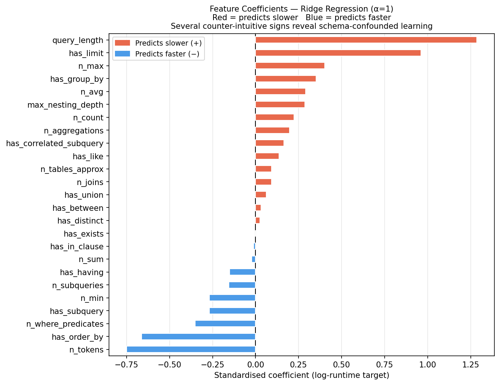

The results at every phase point to the same root cause: the dataset is too small and too unevenly distributed for the model to learn robust cross-schema runtime patterns.

### General improvements

**1. More queries per database.**
With 19-50 queries per database (3 for california\_schools), no individual schema is well-represented. A minimum of 200-500 timed queries per database would give the model enough variation to learn what makes queries slow in that schema context.

**2. More databases, more diverse.**
11 databases is too few, especially when 4 have zero slow queries. A larger benchmark (50+ databases with varied schema complexity, table sizes, and index patterns) would test cross-schema transfer meaningfully.

**3. Keep the middle bracket.**
Dropping 124 rows (24.9% of collected data) removed exactly the borderline examples that would help the model learn where the fast/slow boundary lies. Using regression directly on `runtime_s` -- or a three-class setup -- preserves that variation.

**4. Query-level schema features.**
Phase 6 added database-level stats (same value for every query in a database). The next step is query-level schema features: row counts for the specific tables touched by each query, whether a relevant index exists for each join condition. This requires parsing the SQL to extract table names, then looking up their individual row counts. It would give the model the one remaining piece of information that directly drives query runtime.

**5. Per-database calibration.**
A lightweight per-database fine-tuning step -- even just a schema-specific bias term -- could absorb the runtime offset between schemas and dramatically improve seen-DB performance without requiring more training data.

The core pipeline infrastructure -- timed execution, SQL feature extraction, EXPLAIN QUERY PLAN parsing, labelling, and evaluation -- is sound and reusable. The bottleneck is data volume and data diversity, not pipeline design.

---

## Evidence Files

| File | Contains |
|------|----------|
| `data/query_dataset_features.csv` | Full labelled dataset with features (374 rows) |
| `reports/within_db_schema_metrics.csv` | Phase 6 within-database regression results |
| `reports/schema_stats.csv` | Per-database schema statistics (rows, indexes) |
| `reports/commit_rerun_metrics.csv` | Seen/unseen classification results across pipeline stages |
| `reports/tree_ablation_commit_metrics.csv` | Global vs Tree+Global ablation |
| `reports/tree_fairness_control_metrics.csv` | Matched global vs Tree+Global fairness control |
| `reports/tree_fairness_fixed_lr_metrics.csv` | Fixed-model fairness control |
| `reports/per_database_results.csv` | Per-DB breakdown on financial+formula\_1 holdout |
| `markdowns/RESULTS_50Q_DATABASES.md` | Classification results on superhero+card\_games holdout |
| `markdowns/RESULTS_50Q_REGRESSION.md` | Regression results on superhero+card\_games holdout |
| `markdowns/RESULTS_SCHEMA_STATS.md` | Phase 6 schema statistics analysis |
| `run_schema_stats_model.py` | Phase 6 within-database regression script |
| `run_50q_analysis.py` | Phase 5 classification analysis script |
| `run_50q_regression.py` | Phase 5 regression script |
| `run_full_regression.py` | Phase 3 regression script |
| `run_report_graphs.py` | Generates figures 1-12 |
| `run_phase6_figures.py` | Generates figures 13-14 |

---

## How This Work Maps to the Assignment Brief (COM 763 Task 1)

The assignment brief awards marks across five areas. Here is where this project currently meets or falls short of each, and what would concretely improve the submission.

### Problem Definition and System Framing (15%)

**What is already here:**
The problem is framed clearly -- can SQL query runtime be predicted from structural features, and does that prediction generalise to unseen databases? The machine learning justification is present: manual performance tuning is expensive, and an automated signal would be valuable for database administrators.

**What would improve the mark:**
- Add a short opening paragraph that explicitly states the real-world impact. For example: "A DBA managing hundreds of queries per day cannot manually profile each one. A model that flags likely slow queries before execution saves engineering time and prevents production incidents."
- Reference at least one academic source (e.g. a paper on query cost estimation or learned query optimisers) to demonstrate the work sits within a known research area.
- Include a clear pipeline diagram showing the end-to-end flow: raw BIRD queries -> timing runs -> feature extraction -> labelling -> model training -> evaluation.

---

### Data Pipeline and Feature Handling (25%)

**What is already here:**
- Timed execution across 374 queries, 3 runs each, 30-second timeout
- Quantile-based labelling with explicit justification for the threshold choices
- 25 SQL structural features extracted from query text
- EXPLAIN QUERY PLAN features (9 plan-level counts) as Tree+Global variant
- 6 schema statistics features added in Phase 6
- StandardScaler applied before all linear models

**What would improve the mark:**
- Show the feature extraction pipeline as code screenshots alongside the feature table.
- Justify dropping the middle bracket more explicitly with a histogram of the three groups' runtime distributions.
- Add a correlation matrix or feature importance chart from a fitted model.
- Explain the BIRD Mini-Dev benchmark choice.

---

### Model Implementation and Debugging (30%)

This section is worth the most marks. The brief asks for evidence of **iterative improvement and debugging**, not just a final result.

**What is already here:**
- Multiple pipeline stages tracked with explicit change descriptions
- Multiple classifiers compared (Random Forest, XGBoost, Logistic Regression, Gradient Boosting)
- Deliberate switch from classification to regression based on evidence (Phase 3)
- Tree+Global ablation to isolate the effect of adding plan features
- Schema statistics added and evaluated (Phase 6)

**What would improve the mark:**
- Show a debugging moment explicitly. The decline in seen-DB F1 when more data was added is a real debugging observation -- show it as a before/after with explanation.
- Show cross-validation results. The brief explicitly mentions "cross-validation results" as required visual evidence.
- Include the learning curve with an interpretation: does the model improve with more training data?
- Show screenshots of the model training code.

---

### Experimental Evaluation and Model Selection (20%)

**What is already here:**
- F1, ROC-AUC, and accuracy reported across all models
- Seen-DB vs unseen-DB split evaluated separately
- Fairness control (matched global vs tree+global on same subset)
- Regression R2 as alternative metric
- Per-database breakdown for holdout databases
- Within-database R2 per schema (Phase 6)

**What would improve the mark:**
- Justify the final model selection explicitly.
- Include a ROC curve plot (`reports/roc_curve.png` already exists).
- Include the calibration curve (`reports/calibration_curve.png` exists).
- Add a precision-recall curve (`reports/pr_curve.png` exists).

---

### Presentation, Structure, and Communication (10%)

**What is already here:**
- Clear phase-by-phase narrative with explicit reasoning at each transition
- Tables with exact numbers throughout
- 14 figures covering all key findings
- Honest acknowledgement of failures and their causes
- Justification for each phase's existence

**What would improve the mark:**
- Add a system overview diagram showing the Streamlit deployment.
- Add a pipeline flowchart.
- Trim or signpost the technical tables.
- Check word count against the 2000-word target (+-10%).

---

### Summary: Priority Actions

| Priority | Action | Brief section | Effort |
|----------|--------|---------------|--------|
| High | Add existing ROC curve, PR curve, calibration curve, learning curve from `reports/` | Evaluation (20%) | Low -- files exist |
| High | Add pipeline flowchart diagram | Presentation (10%) + Problem framing (15%) | Medium |
| High | Add Streamlit screenshots and deployment URL | Presentation (10%) | Required |
| High | Add explicit final model selection justification paragraph | Evaluation (20%) | Low |
| Medium | Show feature importance (RandomForest) bar chart | Data pipeline (25%) | Low |
| Medium | Add code screenshots for feature extraction and model training | Implementation (30%) | Medium |
| Medium | Add correlation matrix of features | Data pipeline (25%) | Low |
| Medium | Add cross-validation results table/plot | Implementation (30%) | Low -- file exists |
| Low | Add academic reference for query cost estimation | Problem framing (15%) | Low |
| Low | Add explicit word count check and trim to 2000 +-10% | Presentation (10%) | Low |
